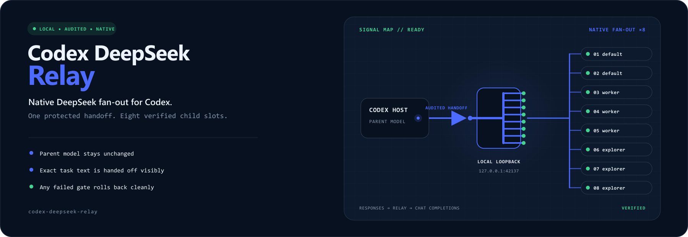
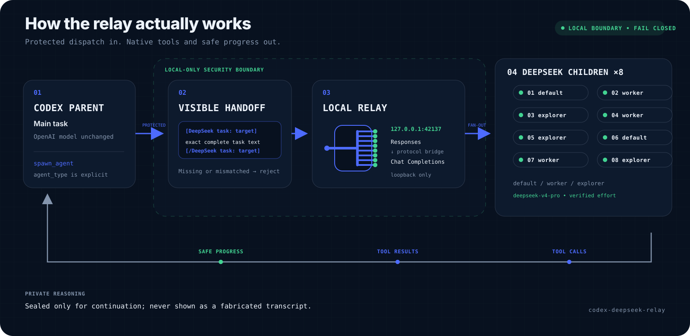
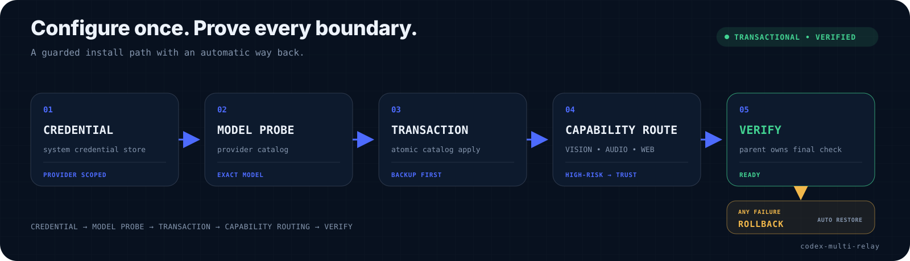

**简体中文** | [English](./README_EN.md)

<p align="center">
  
</p>

<h1 align="center">Codex DeepSeek Relay</h1>

<p align="center">把 Codex 的原生子代理路由到 DeepSeek，并保留可审计的任务交接与执行轨迹。</p>

本机回环适配层把 Codex Responses 转为 DeepSeek Chat Completions，让 `default`、`worker`、`explorer` 三个内置角色全部路由到经在线验证的 `deepseek-v4-pro`，默认允许 8 路并发（8-way fan-out）；主任务继续使用原来的 OpenAI 模型与最高思考强度。

## 能得到什么

- 两个及以上独立任务可像 fan-out subagents 一样并行派发；
- 三个内置子角色全部使用 DeepSeek；
- DeepSeek 思考强度从它的最高档 `max` 开始，按 `max → xhigh → high → medium → low → minimal` 实测；
- 三个子角色都声明 DeepSeek V4 Pro 官方的 100 万 token 上下文，避免未知模型回退值过小；
- 保持新版 `multi_agent_v2`，通过显式 `agent_type` 选择 DeepSeek 角色，不让子代理继承 Sol；
- 本机回环适配层把 Codex Responses 转为 DeepSeek Chat Completions，支持命名空间工具、并行工具调用和思考模式续接；
- 父代理在调用 DeepSeek 前显示完整的结构化任务交接，适配层按子线程目标精确匹配；宿主密文不会被误发给 DeepSeek；
- 子线程界面显示基于真实工具调用生成的安全步骤摘要；模型原始私有思维链不会被伪造或直接暴露；
- Key 只保存在 Windows Credential Manager 或 macOS Keychain；
- 安装前隔离验证 Provider，安装后由真实 Codex 父模型执行完整原生验收，任何失败自动回滚；
- 可随时 disable、enable 或完整 uninstall。

<p align="center">
  
</p>

<p align="center">
  
</p>

## 快速开始

要求：Windows 或 macOS、Python 3.11+、Codex 桌面运行时，以及有效的 DeepSeek API Key。

如果作为 Skill 安装：

```bash
npx skills add Roblis0n/codex-deepseek-relay -g -y
```

也可以直接在项目目录双击 `configure-deepseek-subagents.cmd`。它会自动寻找真正可运行的 Python，并明确显示 Key 的填写提示。

Windows 终端方式：

```powershell
python codex-deepseek-subagent\scripts\codex_deepseek.py setup
```

macOS：

```bash
python3 codex-deepseek-subagent/scripts/codex_deepseek.py setup
```

命令会在当前终端显示本地掩码输入框。Key 不要发到 ChatGPT；输入后保存到系统凭据目标 `codex-deepseek-api-key`。

只有模型实存、最高兼容思考强度、隔离 Provider 探测、正式单代理、三路并发、工具调用、续接和线程元数据全部通过，才返回 `ready`。完整子代理验收只运行一次，并使用实际 Codex 父模型；若失败，事务会恢复原配置。如果服务端暂时没有 `deepseek-v4-pro`，程序返回 `model_unavailable`，正式 Codex 配置不会改变。

## 安装结果

管理器增加一个用户级 DeepSeek Provider。Codex 连接本机 `http://127.0.0.1:42137/v1`，适配层只监听回环地址，并把 Responses 转换为 DeepSeek Chat Completions。随后创建：

```text
$CODEX_HOME/agents/default.toml
$CODEX_HOME/agents/worker.toml
$CODEX_HOME/agents/explorer.toml
```

同时在 `$CODEX_HOME/AGENTS.md` 写入可移除的 fan-out 规则，并保证：

- 顶层主模型、主 Provider、主思考强度不变；
- 并发下限为 8，用户已有更高值时保留；
- 每个子代理显式使用 `agent_type` 与 `fork_turns="none"`（或正数局部上下文），不会误继承主模型；
- 每次 spawn、follow-up 或 send 前先输出与目标一一对应的 `[DeepSeek task: <target>]` 交接块；缺少交接时适配层严格拒绝；
- 不替换正式模型目录；
- 不关闭新版多代理；
- 子代理失败时不静默换成 OpenAI 模型。

## 日常使用

配置成功后，无需重复运行 setup。直接给 Codex 正常任务即可：

```text
并行调查这四个互相独立的模块，最后给出综合结论。
```

受管规则会在任务确实独立时 fan-out；共享状态、同一文件写入和顺序依赖任务仍由主代理串行处理。

Codex 的 OpenAI 父模型会在本机看到 `spawn_agent` 之前就把任务正文变成受保护的 `gAAAA…` 内容，自定义 Provider 没有官方解密接口。受管规则因此会先把同一份完整任务以可见交接块写到父任务评论区，再调用原生子代理工具。适配层只接受目标和顺序均精确匹配的交接；找不到时返回错误，不让 DeepSeek 根据密文猜任务。

DeepSeek 的原始推理内容只用于同一子线程的工具续接，并以完整性保护密文保存。界面中的“思考/步骤”是适配层根据已实际发出的工具调用生成的安全摘要，例如“检查本地状态并运行验证”，不是模型私有思维链的逐字转录。

## 管理命令

以下以 Windows 为例；macOS 把 `python` 换成 `python3`，路径分隔符换成 `/`：

```powershell
python codex-deepseek-subagent\scripts\codex_deepseek.py status --json
python codex-deepseek-subagent\scripts\codex_deepseek.py setup --json
python codex-deepseek-subagent\scripts\codex_deepseek.py test --json
python codex-deepseek-subagent\scripts\codex_deepseek.py repair --json
python codex-deepseek-subagent\scripts\codex_deepseek.py disable --json
python codex-deepseek-subagent\scripts\codex_deepseek.py enable --json
python codex-deepseek-subagent\scripts\codex_deepseek.py uninstall --json
python codex-deepseek-subagent\scripts\codex_deepseek.py uninstall --remove-credential --json
```

- 普通 uninstall 保留 Key。
- 只有带 `--remove-credential` 的 uninstall 才删除系统凭据。
- `repair` 等同于重新执行完整验证后的 setup。
- 自动发现 Codex 失败时，用 `CODEX_DESKTOP_BIN` 指定桌面运行时。

## 安全与回滚

管理器使用进程锁、解析后写入、同目录原子替换和逐文件校验和。备份位于：

```text
$CODEX_HOME/codex-deepseek-subagent/backups/
```

Key 不进入配置、命令参数、临时文件、备份、日志、异常或 Git。旧单角色安装只在 manifest、受管标记和校验和共同证明所有权时自动迁移。

更多细节见 [兼容性与安全边界](codex-deepseek-subagent/references/compatibility.md) 和 [Skill 执行规则](codex-deepseek-subagent/SKILL.md)。

## 开发验证

```bash
python -m unittest discover -s scripts -p "test_*.py" -v
python -m compileall -q codex-deepseek-subagent/scripts scripts
python scripts/check_runtime_contract.py
python scripts/check_codex_bridge_runtime.py --codex-bin <path-to-codex>
```

## 品牌说明

本项目是独立社区工具，与 OpenAI 或 DeepSeek 不存在隶属、合作或官方背书关系。ChatGPT、OpenAI、DeepSeek 及其标志归各自权利人所有。

## License

[MIT](./LICENSE)
